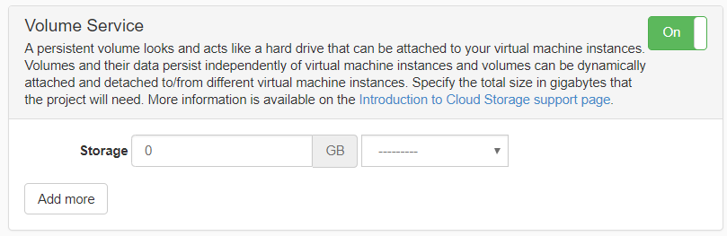

A volume storage allocation can be requested using the Allocation Request form, under Allocations on your dashboard, either as part of a New Request (resulting in a new project) or as an amendment to an existing project under My Requests. 

Like instances, volumes are hosted in an availability zone and importantly volumes can only be attached to instances running in the same availability zone. When requesting a volume storage allocation, you will need to consider where your solution will be hosted.

