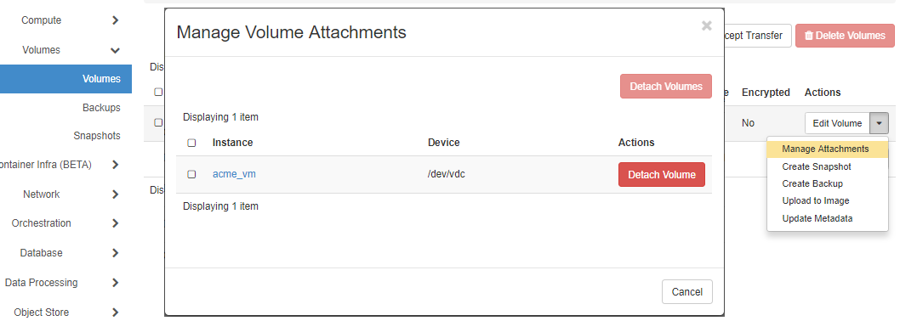

You can use the `umount` command (note the spelling of the `umount` command) to unmount your device from its mount point (here `/pvol`). E.g.

```
$ sudo umount /pvol
```

You can use the Nectar dashboard to detach a volume from an instance. Navigate to the Volumes | Volumes page, and use the ActionMenu for your volume to show the Manage Volume Attachments dialog. (Alternatively you can use the ActionMenu of the instance on the Compute | Instances page)




Notes: Volumes **must** be detached before deletion.